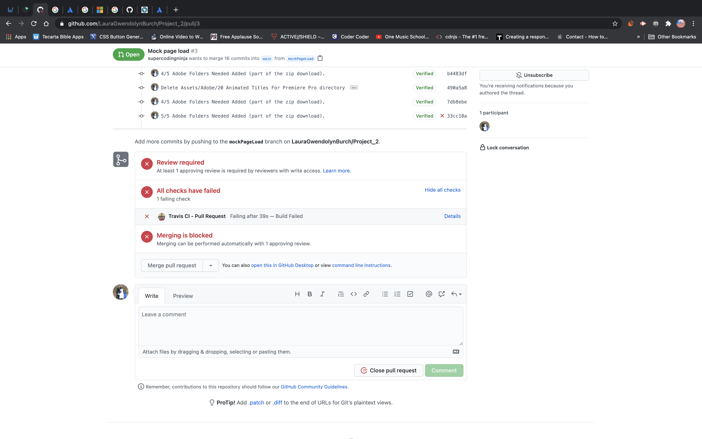
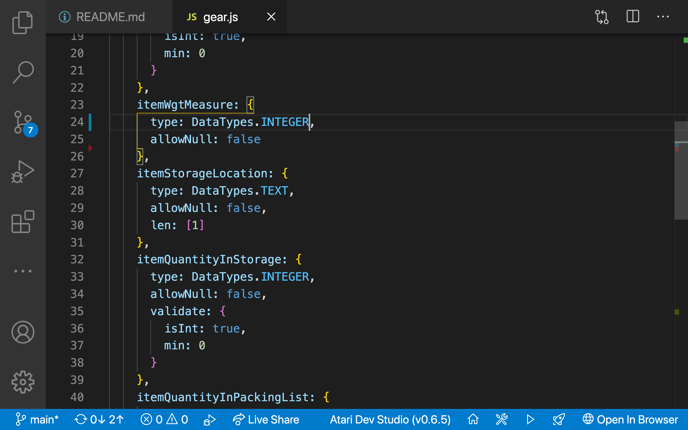
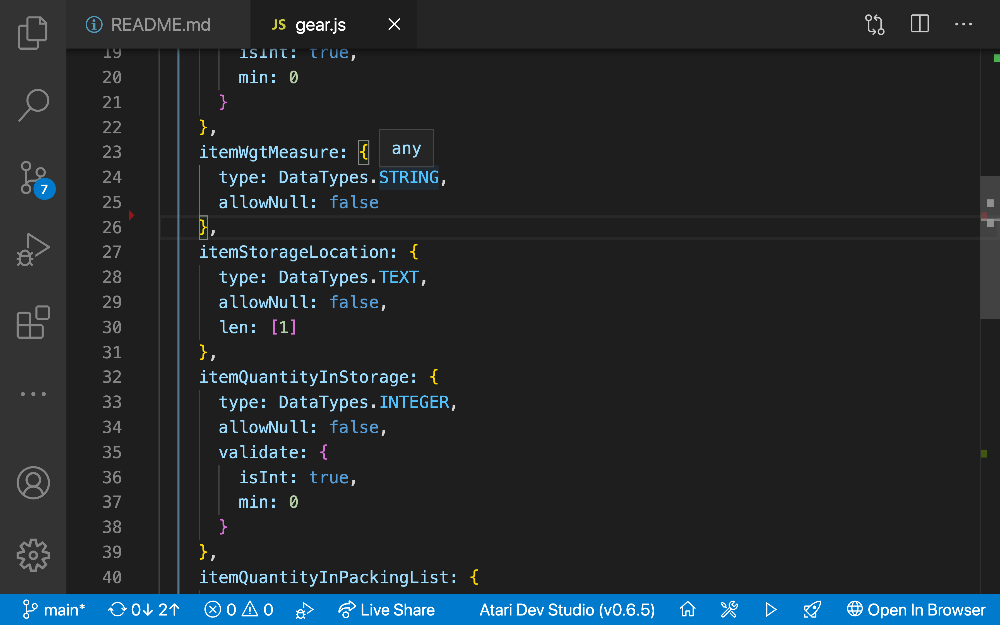

# All Gear Essiential

   [GitHub Profile](https://github.com/supercodingninja) • [YouTube](https://www.youtube.com/watch?v=PkZNo7MFNFg&list=PLnxMwdxjTgTEN-xRODXLJ6sI5hgz1lFbu) •  [Facebook](https://www.facebook.com/SuperCodingNinja) •  [Email Me](mailto:SuperCodingNinja@outlook.com)
#### AllGearEssential© 2021 All Rights Reserved.  GPL3.0 All material must be cited or credited, when using material (free to use).  An application that mySQL, Sequelize, Node.js and Handlebars to help you track and pack your essential gear.

## Table of Contents

- [Location](#location)
- [Demo](#demo)
- [Installation](#installation)
- [Usage](#usage)
- [Testing](#testing)
- [Contributors](#contributors)
- [Resources](#resources)
- [Point of Contact](#point-of-contact)
- [License](#license)

## Location
###### [Back to Table of Contents](#Table-of-Contents)
Deployed Applications: [Personal Stretch Goal](https://allgearessential.herokuapp.com/) and [Team](https://secret-harbor-98103.herokuapp.com/)

GitHub Repositories: [Personal Stretch Goal](https://github.com/supercodingninja/AllGearEssential) and [Team](https://github.com/LauraGwendolynBurch/Project_2)

## Demo
###### [Back to Table of Contents](#Table-of-Contents)

### Video: Pull Request During Group Project 👇🏿

### Travis Denies Merege Request

### Trouble-shooting: Modal Has Incorrect Data Type

### Solution: Modal Given Correct Data Type

## Installation
###### [Back to Table of Contents](#Table-of-Contents)
1.  Ensure that your application includes the require dependacies, by typing the commnd in your integrated terminal "npm install inquirer".
2.  Create a .gitignore file and include node_modules/ and .DS_Store/ so that your node_modules directory isn't tracked or uploaded to GitHub.
3.  Run “node [fileName].js”
4.  Run "npm i."
5.  Run "npm start."
6.  Click on localHost, and view in browser.

## Usage Information
###### [Back to Table of Contents](#Table-of-Contents)
This project can be used for projects, non-profit organizations, academic clubs; and much more!  Not for commercial use, unless granted by the author.

## Testing
###### [Back to Table of Contents](#Table-of-Contents)
Following the usage instructions will allow for testing the functionality of the application. If no errors are thrown in the console and the application works, it's 'passing'.

## Contributors
###### [Back to Table of Contents](#Table-of-Contents)
[Frederick Thomas](https://github.com/supercodingninja)
#### Earlier Contributions
[Laura Gwendolyn Burch](https://github.com/LauraGwendolynBurch), [Gavin Calkins](https://github.com/Gavin867), [Ilya Libershteyn](https://github.com/ilya-libershteyn), and [Meagan Sheehan-James](https://github.com/merikettapearl212)

## References
###### [Back to Table of Contents](#Table-of-Contents)
1.  [NPMjs](https://www.npmjs.com/) provides Documentation, Installation, Examples, Methods, Objects, Questions, Answers, Separator, Prompt Types, User Interfaces and Layouts, Reactive Interface, Support, Known issues, News, Contributing, License, and Plugins.

2.  [Shields IO](https://shields.io/) provides documentations on how to add your shield, for creditbility.  Please feel free to view this resource, for your future developments.

3.  [How to Reverse Engineer Web Applications](https://www.slideshare.net/JarrodOverson/how-to-reverse-engineer-web-applications) here, Jarrod Overson, Director at Shape Security, shares workshop slides (originally given at the WOPR Summit in Atlantic City). He suggest to use JavaScript parsers and generators (like Shift, combined with Puppeteer), and Chrome to reverse engineer web applications.

4.  **[Eloquent JavaScript](https://eloquentjavascript.net/)**, 3rd edition (2018)
This is a book about JavaScript, programming, and digital wonders. Read it online here; or get your own paperback copy.  Written by Marijn Haverbeke.  Licensed under a Creative Commons attribution-noncommercial license. All code in this book may also be considered licensed under an MIT license.

5.  [Guide to Handlebars: Templating Engine for Node/JavaScript](https://stackabuse.com/guide-to-handlebars-templating-engine-for-node/) explains that express is a routing, and middleware is a web framework; which has minimal functionality of its own (express applications are series of middleware function calls).

6.  [Using Middleware and Express](https://expressjs.com/en/guide/using-middleware.html) **Guide to Handlebars: Templating Engine for Node/JavaScript**, by Janith Kasun helps you understand Template Engines, Handlebars; and how to use them!

7.  [Web Application Architecture](https://hackr.io/blog/web-application-architecture-definition-models-types-and-more) describes architecture, Models of Web Componets,Types of Web Application Architecture; and Web App Development Tips!

8.  [Markdown Syntax](https://www.markdownguide.org/basic-syntax/) provides documentations on how to add your shield, for creditbility.  Please feel free to view this resource, for your future developments.

9.  [Markdown Syntax](https://www.markdownguide.org/basic-syntax/) provides documentations on how to add your shield, for creditbility.  Please feel free to view this resource, for your future developments.  

## Point of Contact
###### [Back to Table of Contents](#Table-of-Contents)
I hope this repository helps you along your development.  Stay on task, Get Ahead, Change The World! - [Frederick Thomas](https://www.linkedin.com/in/discoverfrederickthomas/), Super Coding Ninja™

## License
###### [Back to Table of Contents](#Table-of-Contents)
 2021  Frederick Thomas, Laura Gwendolyn Burch, Gavin B. Calkins, Ilya Libershteyn, and Meagan Sheehan-James. 

This program is free software: you can redistribute it and/or modify
it under the terms of the GNU General Public License as published by
the Free Software Foundation, either version 3 of the License, or
(at your option) any later version.

This program is distributed in the hope that it will be useful,
but WITHOUT ANY WARRANTY; without even the implied warranty of
MERCHANTABILITY or FITNESS FOR A PARTICULAR PURPOSE.  See the
GNU General Public License for more details.

You should have received a copy of the GNU General Public License
along with this program.  If not, see <https://www.gnu.org/licenses/>.